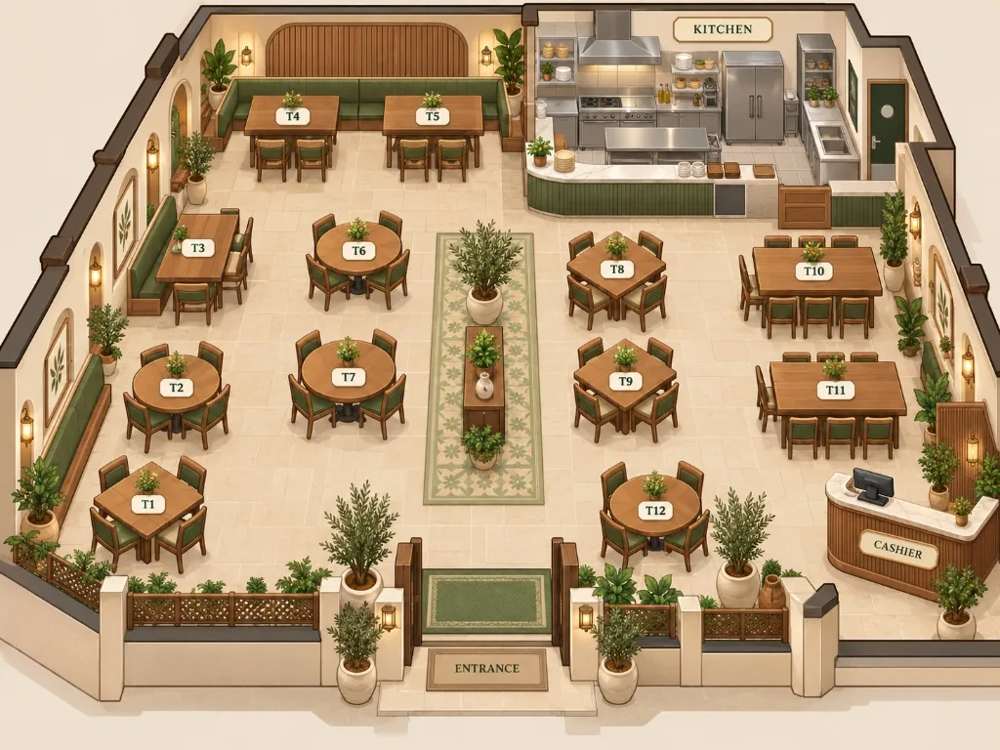

<div align="center">

<picture>
  <source media="(prefers-color-scheme: dark)" srcset="apps/web/public/brand/jubran-logo-dark.webp" />
  
</picture>

### AI-Powered QR Table Ordering & Restaurant Management — العربية / English

Guests scan the QR code on their table, browse the menu, order, call staff and talk to an **Arabic / English AI waiter** (text or live voice) — while staff follow every table **in real time** and manage the menu, tables and QR codes.


**Engineered by Anas Aldahamsheh — تطوير: أنس الدحامشة**

</div>

---

## 📖 Overview

Jubran is a full-stack table-ordering platform built for **Jubran**, a rooftop restaurant on Abdali Boulevard, Amman.

| Part | Folder | Stack |
|---|---|---|
| 🌐 Website (guests + admin panel) | `apps/web` | Next.js 16 (App Router), React 19, Tailwind CSS 4, TypeScript |
| ⚙️ API | `services/api` | FastAPI, SQLAlchemy 2 (async), Alembic, PostgreSQL 16 + pgvector |
| 🐳 Infrastructure | `docker-compose.yml` | PostgreSQL + pgvector, and (with `--profile app`) the API and website |

---

## ✨ Features

### 🍽️ For Guests (no sign-up — just scan the table's QR code)
- Browse the menu with photos, product details, quantities and notes
- Server-side **basket** that is reviewed and **explicitly confirmed** before it becomes an order (prices re-checked at submit)
- Live **order tracking**: waiting for approval → preparing → ready, with multiple orders per visit
- **Change a sent order** until it is ready — changes made while cooking are highlighted for staff
- Table services: call staff, tissues, clean table, request the bill, feedback and complaints

### 🤖 AI Waiter (Arabic — Jordanian dialect — English and mixed)
- Answers menu questions (varieties, prices, availability), recommends one dish, edits the basket, summarizes and confirms orders, changes sent orders, requests services and handles complaints and ratings
- **Hybrid menu search**: dish-name matching + semantic embeddings (pgvector), with graceful fallback when the AI provider is unavailable
- **Dictation** (speech to text) and **live speech-to-speech voice** over WebSocket
- Strict **server-side guards**: a dish can only be ordered after it was shown, an order is sent only after the guest's explicit confirmation, and the table and guest always come from the server — never from the model
- Per-purpose AI settings (chat, menu search, speech to text, live voice), each with its own provider (**Gemini** or **OpenAI**), model and encrypted API key, plus usage and cost tracking

### 🧑‍🍳 For Staff (Admin Panel)
- **Live floor map** of every table with order and service queues (real-time over WebSockets)
- Per-guest table details: orders, changes, requests and bill, plus closing the table
- **Menu management**: restaurant info, opening hours, categories, dishes, availability and photos
- **Tables & QR codes**: issue, replace and download printable QR codes as PDF
- **AI settings** page with connection checks and a 7-day usage / cost report

### 🔒 Security & Reliability
- HttpOnly cookie sessions (hashed tokens), **CSRF protection** and WebSocket origin checks
- Production **refuses to start** with weak or default secrets, debug mode or insecure cookies
- Stored secrets (AI keys, QR tokens) encrypted with rotatable `DATA_ENCRYPTION_KEYS`
- Rate limits, request-size caps, content-based upload validation and security headers / CSP
- Transactional **outbox** for realtime events, Alembic migrations applied automatically at start-up
- Manual ordering keeps working even when the AI provider is down

### 🌍 Experience
- Bilingual **Arabic / English** interface with RTL support
- Light / dark mode, motion and fully responsive layouts for phones and desktops

---

<div align="center">

<br/>
<sub>The restaurant floor plan behind the live admin floor map</sub>
</div>

---

## 🚀 Getting Started

### Prerequisites

- **Docker** (for PostgreSQL + pgvector)
- **Python 3.10+**
- **Node.js 22.6+** (see [`.nvmrc`](.nvmrc))

### 1. Configure the environment

```bash
cp .env.example .env
```

Fill in at least `POSTGRES_PASSWORD` (and `GEMINI_API_KEY` or `OPENAI_API_KEY` for the AI assistant). Every variable is documented inside [`.env.example`](.env.example).

### 2. Install dependencies

```bash
# API
cd services/api
python -m venv .venv
# Windows: .venv\Scripts\activate    |    macOS / Linux: source .venv/bin/activate
pip install -e ".[dev]"            # or: pip install -r requirements.txt
cd ../..

# Website
npm --prefix apps/web install
```

### 3. Run

**Windows (one click):**

```bat
run_all.bat
```

It starts the database (Docker), the API on port **8001** and the website on port **3001** in separate windows.

**Any OS (manually):**

```bash
# Database
docker compose up -d

# API (from the project root) — migrations run automatically at start-up
ENVIRONMENT=development services/api/.venv/bin/python -m uvicorn jubran.main:app \
  --app-dir services/api/src --host 0.0.0.0 --port 8001 --reload

# Website (in another terminal)
npm --prefix apps/web run dev
```

| Address | What |
|---|---|
| http://localhost:3001 | Website (staff sign-in) |
| http://localhost:3001/admin/floor | Admin — live floor map |
| http://localhost:8001/docs | API documentation (Swagger) |

> In development, demo sign-ins are available (`admin@jubran.jo` / `admin12345`). They are disabled in production.
> Guests enter through a table's QR code — open **Admin → Tables & QR → "Try as customer"** to test the guest side locally.

---

## ⚙️ Key Environment Variables

| Variable | Description |
|---|---|
| `POSTGRES_USER` / `POSTGRES_PASSWORD` / `POSTGRES_DB` | Database created by Docker Compose |
| `DATABASE_URL` | How the API reaches PostgreSQL |
| `ENVIRONMENT` | `development` for local runs, `production` (default) on a server |
| `SECRET_KEY`, `CSRF_SECRET` | Long random secrets (`python -c "import secrets; print(secrets.token_urlsafe(48))"`) |
| `DATA_ENCRYPTION_KEYS` | Fernet key(s) that encrypt stored AI keys and QR codes (required in production) |
| `ADMIN_EMAIL`, `ADMIN_PASSWORD` | First administrator in production |
| `GEMINI_API_KEY`, `OPENAI_API_KEY` | Default AI provider keys (can also be set per purpose in Admin → AI settings) |
| `NEXT_PUBLIC_API_URL`, `NEXT_PUBLIC_SITE_URL` | Website build settings for production (API address and the address printed in QR codes) |

> ⚠️ Never commit your real `.env` file — it is excluded by `.gitignore`.

---

## 🧪 Tests

```bash
# API — unit + integration tests (SQLite by default, no network)
cd services/api
python -m pytest

# Website — page logic tests (Node 22.6+)
npm --prefix apps/web test
```

- The API suite covers ordering and confirmation, race conditions, assistant guards, voice, realtime relay, sessions, security (cookies, CSRF, headers, rate and upload limits) and migrations. `test_full_visit_journey.py` walks one visit end to end: QR → order → kitchen → bill → rating → table closed.
- Set `TEST_DATABASE_URL` (and `MIGRATION_TEST_DATABASE_URL`) to run them on PostgreSQL.
- `tests/evaluation` contains **57 golden conversations** for the real AI model (opt-in with `AI_LIVE_TEST=1`).

---

## 🏗️ Architecture

```txt
apps/web/                 Next.js website
  app/                    Pages: /t/[token] (QR entry), /menu, /orders, /assistant, /login, /admin/*
  components/             Customer, admin, common and UI components
  context/ · lib/         Language & theme, API client, realtime sockets, voice, QR / PDF helpers
services/api/src/jubran/  FastAPI service
  domain/                 Enums, money (JOD stored as fils), exceptions
  application/            Use cases: sessions, ordering, menu, floor, services, auth, rate limits, events
    ai/                   Assistant (text / voice / live), tools + guards, hybrid search, transcription
  infrastructure/         Database (models, migrations, seed + menu photos), auth, images, media store
  interfaces/             HTTP routers, cookies, CSRF, security headers, WebSocket gateway
services/api/tests/       Unit, integration and AI evaluation tests
docker-compose.yml        PostgreSQL 16 + pgvector (+ API and website with --profile app)
```

**API (`/api/v1`)** — table sessions, menu, basket & orders, order amendments, service requests, complaints, feedback, assistant (chat, confirmations, dictation, voice), auth and admin endpoints.
**WebSockets** — `/ws/admin`, `/ws/customer/{table_session_id}`, `/ws/assistant/voice`.

---

## ☁️ Deploy on a Server

1. Fill in `.env` for production: `ENVIRONMENT=production`, `SECRET_KEY`, `CSRF_SECRET`, `DATA_ENCRYPTION_KEYS`, `POSTGRES_PASSWORD`, `ADMIN_EMAIL` / `ADMIN_PASSWORD`, `CORS_ORIGINS`, `NEXT_PUBLIC_API_URL`, `NEXT_PUBLIC_SITE_URL`.
2. Build and start everything:
   ```bash
   docker compose --profile app up -d --build
   ```
3. Put an HTTPS reverse proxy (Caddy, nginx, a cloud load balancer) in front of ports **3001** (website) and **8001** (API) and set `FORWARDED_ALLOW_IPS` to its address. If the website and API are on different sites, also set `COOKIE_SAMESITE=none`.

The API refuses to start in production with unsafe settings and tells you which ones.

---

## 📷 Photo Credits

Menu photos are free-licence images from Wikimedia Commons and Openverse (plus the restaurant's own photos). Attribution is listed in [`CREDITS.md`](services/api/src/jubran/infrastructure/db/menu_photos/CREDITS.md).

---

## 👨‍💻 Author

**Anas Aldahamsheh — أنس الدحامشة**

- 📞 Phone: `+962 789 495 167`
- 💼 LinkedIn: [linkedin.com/in/anas-aldahamsheh](https://www.linkedin.com/in/anas-aldahamsheh)
- 🐙 GitHub: [github.com/anas-aldahamsheh](https://github.com/anas-aldahamsheh)
